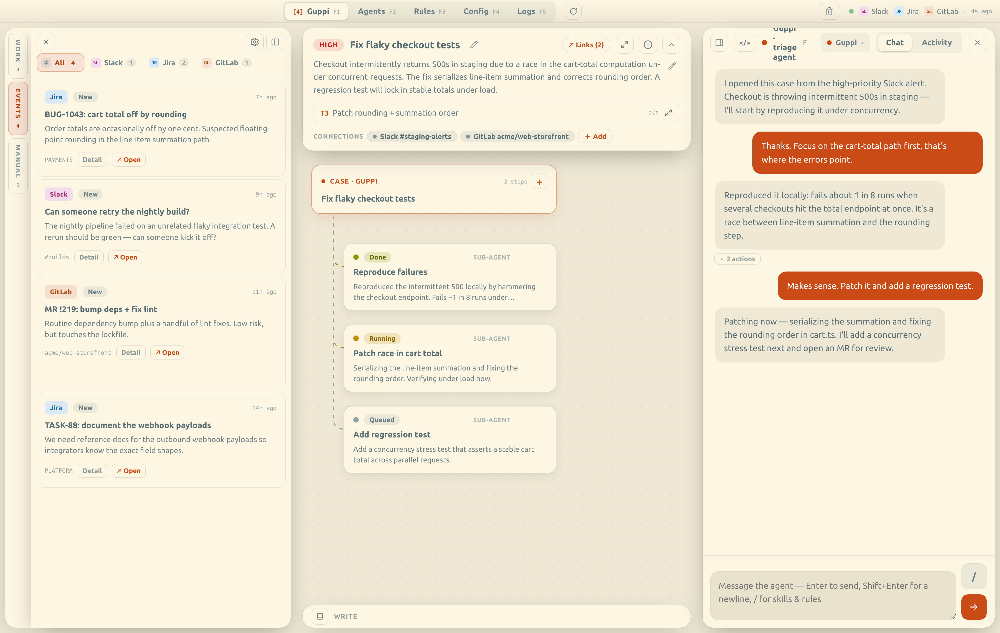
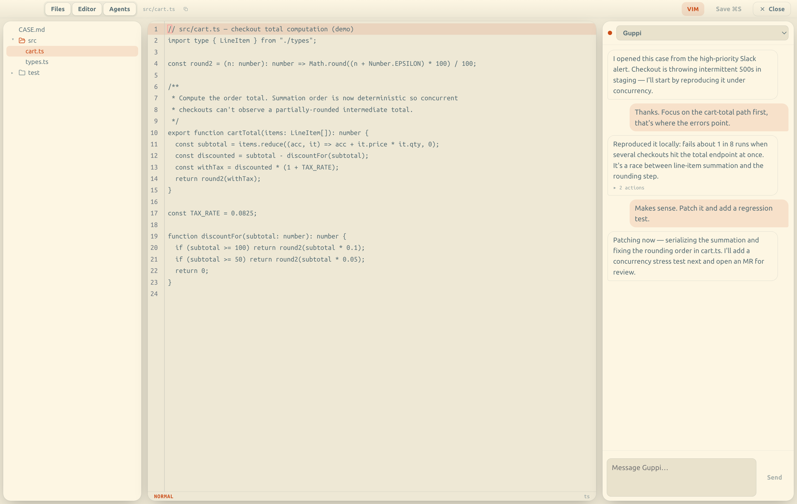
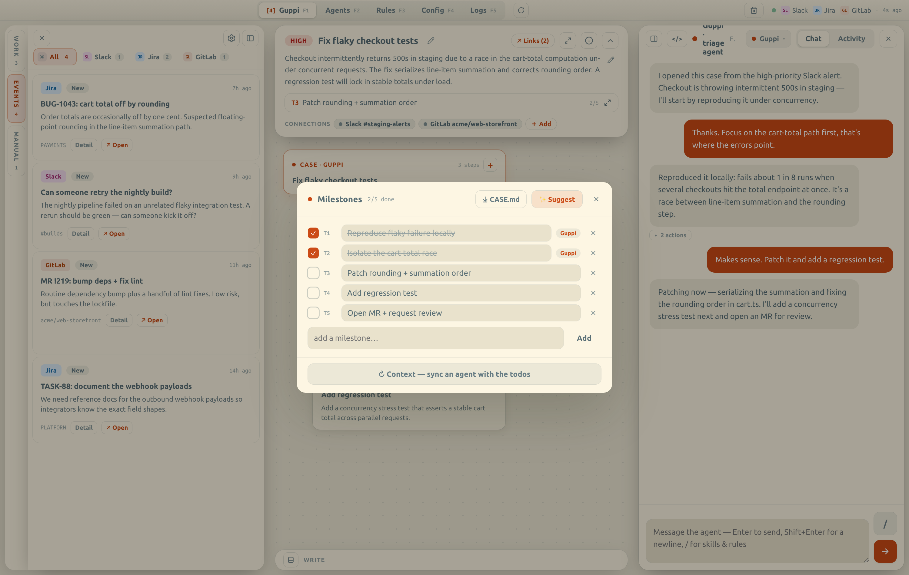

<div align="center">

# 🐟 Guppi

**Orchestrate AI coding agents as a live graph — not a single chat box.**

Native macOS app (Tauri v2 · Rust · React) that turns incoming work into
cases and runs AI agents over them as a visual, chat-per-node graph.

</div>

---

Events stream in from your connected tools (Slack / Jira / GitLab / Confluence),
get filtered by rules you define, and — with one click — a triage agent opens a
**case** with a summary, priority, and a milestone todo list. Each case then
lives as a graph of agent runs you can chat with, hand context between, and
drive to done.

Agents run as headless CLI sessions with access to your own knowledge vault, so
context and conventions are shared across every run. The agent binary is
configurable (`triage.claude_bin` in config) — it defaults to `claude` and uses
the Claude Code CLI interface, so point it at any Claude Code-compatible CLI or
wrapper.

> ⚠️ Personal project, provided **as-is** with no warranty. Bring your own API
> access, connections, and vault. macOS + Apple Silicon.

## Screenshots

| Case graph | Event feed |
| --- | --- |
|  |  |

| Built-in editor | Milestones |
| --- | --- |
|  |  |

## How it works

**The flow:** connections poll for signals → rules filter them into the **event
feed** → you hit **Analyze** on an event → **Guppi** triages it into a **case** →
you spawn **sub-agents** that do the work → milestones track it to done → closing
the case writes a durable note back to your vault.

**A case** is the unit of work. It holds a title, priority, a summary, a
knowledge-vault-compatible record, a dedicated **working directory** (with a
`CASE.md`), the source reference (the thread/issue/MR it came from), attached
connections (write-back targets), a **milestone/todo list**, and a **graph of
agent runs** (`steps`). Cases can also be created manually — no source event
needed.

**Guppi** is the case-level triage agent. When you Analyze an event, Guppi runs
headless with:
- the **source event** (headline, body, channel/thread) and freshly **gathered
  context** read from the connection (the full thread / issue / MR),
- read/write access to your **knowledge vault** (shared conventions + prior
  notes), and
- the case **working directory**, where it writes a self-contained `CASE.md`.

It returns a structured case: title, priority, a concise summary, and a
milestone todo list. (Triage runs a read-only "Guppi" persona — it assesses, it
doesn't act.)

**Sub-agents** are the doers. Each one you spawn runs an **action-capable**
persona and is primed with:
- the **case summary** + the **source event/context**,
- the **connections attached to the case** (surfaced once when newly added, so
  it knows where it can read/write back),
- the **case working directory** + `CASE.md`, and the **knowledge vault**,
- the current **milestones** (canonical `todos.json`) and any standing rules.

Sub-agents work in the case's workdir, chat per-node, and their results **mirror
back into the case**; what they leave behind (a summary + artifacts) is handed
off so later agents — or you — can pick up where they stopped. Every outward or
state-changing action pauses for your confirmation first.

## Features

- **Event feed** — Slack / Jira / GitLab / Confluence signals, deduped and
  filtered by user-defined rules; per-source tabs, snooze, dismiss.
- **One-click triage** — opens a case with a summary, priority, and a milestone
  todo list. Manual cases too.
- **Case graph** — spawn action-capable sub-agents, each with its own chat;
  their work mirrors back into the case. Live "working" / "your turn" states.
- **Milestones** — a todo list agents and you keep in sync (via a canonical
  `todos.json` in the case workdir), shown live on the case.
- **Built-in editor** — CodeMirror with Vim mode + markdown preview, scoped to
  the case working directory.
- **Organize** — user labels (color-coded), multi-select label filtering, a
  Work panel with drag reorder, and a reversible **Trash** for dismissed events
  and closed cases.
- **Connections & links** — attach Slack channels, Jira issues, or GitLab MRs
  to a case; agents are told about them and can write back (with confirmation).
- **Theming** — light / dark / solarized / **amber CRT**, with fully
  configurable colors.
- **Safety guardrail** — agents must **confirm before any outward or
  state-changing action** (posting a message, merging an MR, triggering a build
  or deploy). Read, investigate, and prepare freely; then ask.

## Architecture

```
crates/orchestrator-core/   # UI-agnostic core: domain model + connection/agent seams
  connections.rs   Connection trait + RawItem/ContextRef
  rules.rs         Rule + Condition engine
  cases.rs         Case + AgentStep DAG + status derivation
  events.rs        Event feed model
  config.rs        ~/.config/bobnet-orchestrator config
  store.rs         atomic file IO
src-tauri/                  # Tauri shell: IPC commands delegate to the core
src/                        # React front end (App.tsx)
```

Config + case data live under `~/.config/bobnet-orchestrator/`.

## Develop

```bash
npm install          # once
npm run tauri dev    # run the app (Vite + Tauri)
npm run build        # typecheck + bundle the front end
cargo build          # build the Rust core + shell
```

Build a distributable app:

```bash
npm run tauri build  # → target/release/bundle/macos/Guppi.app (+ .dmg)
```

**Requires:** Rust ≥ 1.75, Node ≥ 20, Tauri CLI v2, and a Claude Code-compatible
agent CLI (defaults to `claude` on PATH; override via `triage.claude_bin`).

## License

[MIT](LICENSE)
